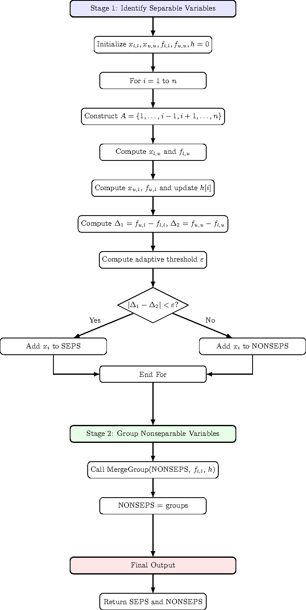
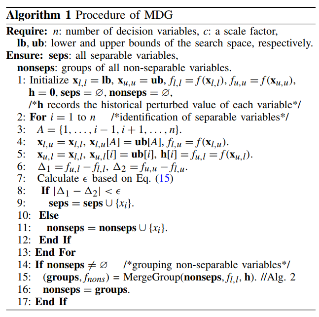
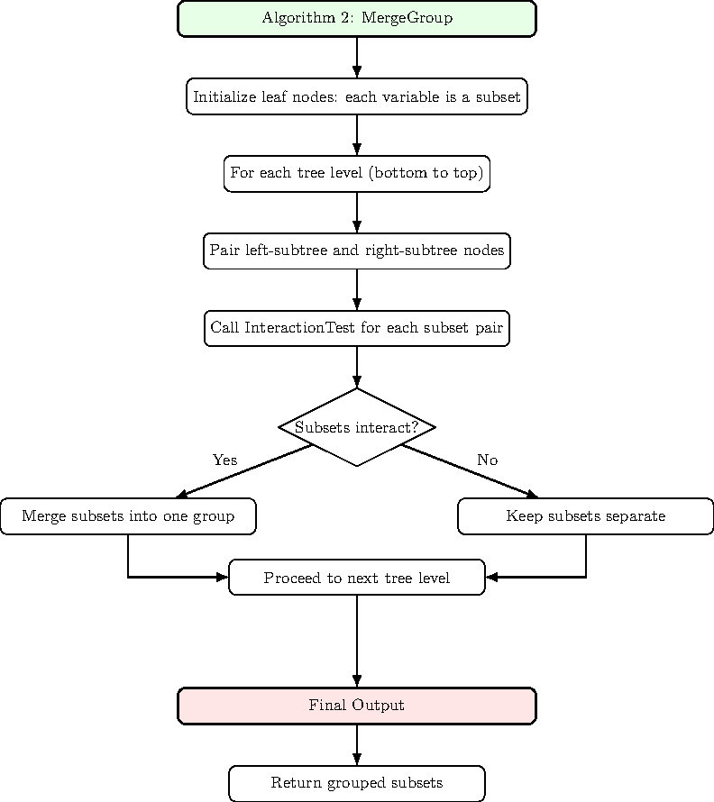
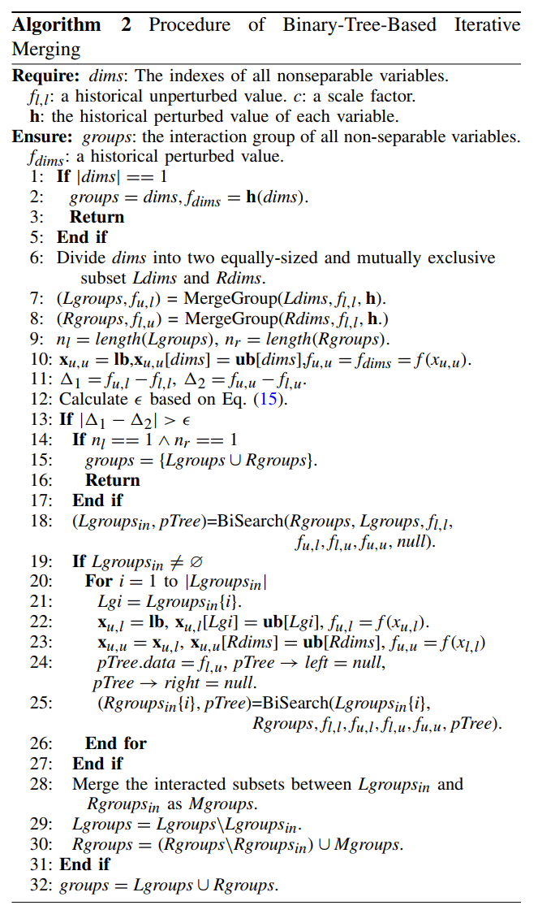
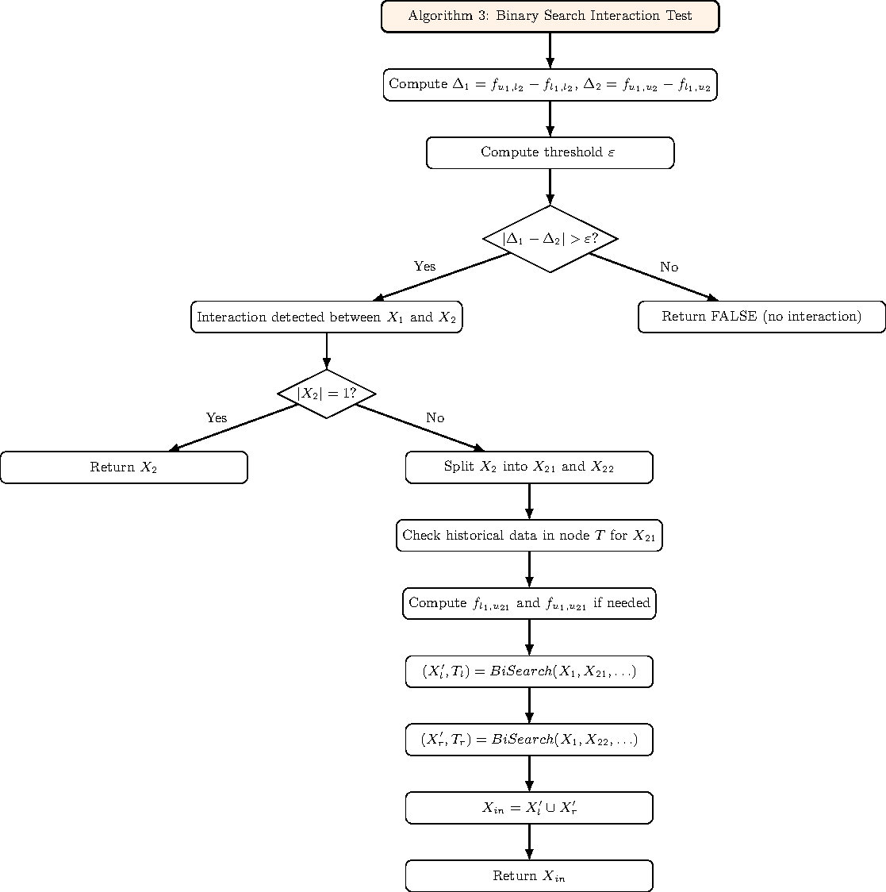
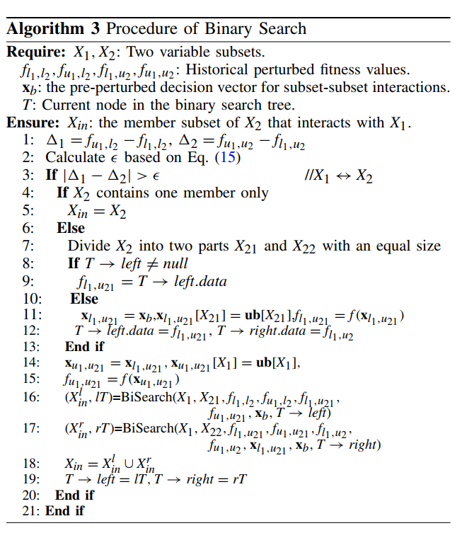

# MDG(Merged Differential Grouping)

As an optimized variable grouping method, MDG is equiped with the following key features:
- **1. High effiency:** 
The computational complexity of MDG is $O\left(max\left\{n, n_{ns}\times\log_2 k\right\}\right)$, which is lower than the best complexity $O\left(n\log_2n\right)$ among FII, RDG, RDG2, and ERDG.
- **2. High grouping accuracy:**
Firstly, MDG detects the subset-subset interaction ,rather than traditional variable-variable interction, which helps focusing on overall variables' interaction. Secondly, MDG employs adaptive threshold in order to better evaluate the interction of each variable sebsets. Last but not least, MDG adopts a binary-tree-based merging approach and calculations in each layer are independent, which avoids misjudgements caused by the accumulation of noises such as floating-point errors.
- **3. Parameter-free**

The grouping process in MDG can be divided into two stages. In stage 1, MDG identifies each variable as either seperable ot nonseperable variable. In stage 2, the nonseperable variables are assigned into different groups, based on the subset-subset interaction and a binary-tree-based iterative merging method.

The main procedure of MDG is as follows:

  

  

## The main improvement ideas of MDG

### Binary-Tree-Based Iterative Merging
Binary-Tree-Based Iterative Merging is a divide-and-conquer grouping strategy used in MDG to efficiently spare nonseparable variables. Its core idea is to put variables into a binary tree and merge them level by level, detecting interactions only between subsets in the same level. This hierarchical merging design brings several key advantages:
1. **Dramatically reduced computational complexity**
- Instead of checking all variable pairs ($O(n)$, like DG), the binary?tree structure  only needs $O(n log_2n)$ interaction checks.
- Each level halves the number of nodes, so the consumption of computing resources is decreasing.
2. **Capture both direct and indirect interactions**
- When two interacting subsets merge at a lower level, the merged subset propagates upward. This allows MDG to automatically detect indirect multi-variable interactions, which classical DG often could not capture.

Binary-Tree-Based Iterative Merging works like this£º

  

  

We could also take a simple function as example:

  

### Binary Search
Binary search serves as a core efficient mechanism to detect subset¨Csubset variable interactions in MDG. It recursively splits a candidate variable subset into two equal halves, checks for interactions between the target subset and each half using MDG's adaptive threshold, and reuses historical fitness evaluation information to minimize computational cost. This process narrows down interactive sub-subsets exponentially, enabling accurate and efficient variable grouping while reducing the number of fitness evaluations per interaction check, thus enhancing MDG's overall decomposition efficiency for LSGO.

The procedure of Binary Search is as follows:

  

  

Here is an example of Binary Search to check the interaction between $X_1$ and $X_2$

  

### Historical evaluation information reuse
MDG stores historical perturbed values when a variable or a variable set is first perturbed. 
When MDG is checking new interactions that need to evaluate the same perturbation values, it reuses the stored values instead of calculation again. This helps save a lot of computing resources.

### Adaptive threshold
MDG introduces an adaptive threshold based on multiple fitness values, the number of variables and the rounding error of floating numbers, in order to better evaluate the interaction of each pair of varible subsets.

The calculation method of $\epsilon$ is as follows:
$$\epsilon = c \times 2^{-52} \times F_{max} \times dim$$

Where:

$F_{\max} = \max\{f_1, f_2, f_3, f_4\}$

$c = 0.003$ (a prespecified parameter)

$2^{-52}$ (Floating-point error)

$dim$ is the problem dimensionality.