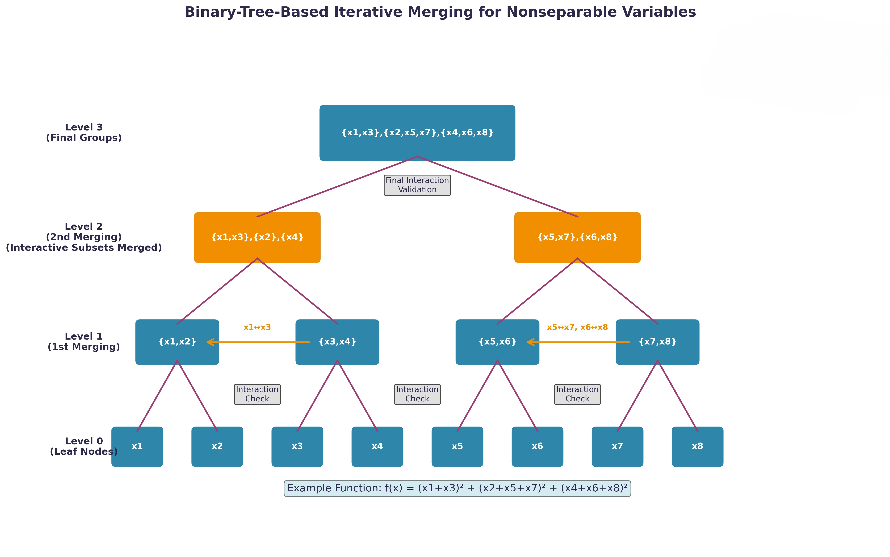
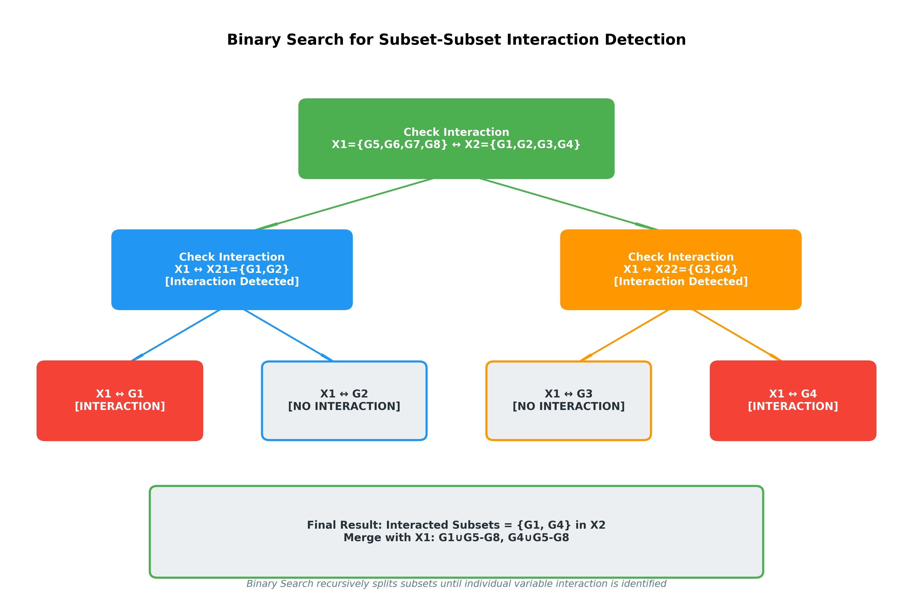

# MDG (Merged Differential Grouping)

As an optimized variable grouping method, **MDG** is equipped with the following key features:

### Key Features
* **1. High Efficiency:** The computational complexity of MDG is $O(\max\{n, n_{ns}\times\log_2 k\})$, which is lower than the best complexity $O\left(n\log_2n\right)$ among FII, RDG, RDG2, and ERDG.
* **2. High Grouping Accuracy:** 
    * **Subset-Subset Interaction:** MDG detects the subset-subset interaction, rather than traditional variable-variable interaction, which helps focusing on overall variables' interaction.
    * **Adaptive Threshold:** MDG employs an adaptive threshold in order to better evaluate the interaction of each variable subset.
    * **Binary-Tree-Based Merging:** MDG adopts a binary-tree-based merging approach where calculations in each layer are independent, avoiding misjudgements caused by the accumulation of noises such as floating-point errors.
* **3. Parameter-free**

---

## Grouping Process
The grouping process in MDG can be divided into two stages:
1.  **Stage 1:** MDG identifies each variable as either a **separable** or **nonseparable** variable.
2.  **Stage 2:** The nonseparable variables are assigned into different groups based on the subset-subset interaction and a binary-tree-based iterative merging method.

### Main Procedure

  
  

---

## The Main Improvement Ideas of MDG

### Binary-Tree-Based Iterative Merging
Binary-Tree-Based Iterative Merging is a divide-and-conquer grouping strategy used in MDG to efficiently spare nonseparable variables. Its core idea is to put variables into a binary tree and merge them level by level, detecting interactions only between subsets in the same level.

#### Key Advantages:
* **Dramatically reduced computational complexity:** Instead of checking all variable pairs ($O(n^2)$ like DG), the binary-tree structure only needs $O(n \log_2 n)$ interaction checks.
* **Resource Efficiency:** Each level halves the number of nodes, so the consumption of computing resources is decreasing.
* **Capture both direct and indirect interactions:** When two interacting subsets merge at a lower level, the merged subset propagates upward, allowing MDG to detect indirect multi-variable interactions.

#### Merging Mechanism:

  
  

**Simple Function Example:**

  

---

### Binary Search
Binary search serves as a core efficient mechanism to detect subset–subset variable interactions in MDG. It recursively splits a candidate variable subset into two equal halves, checks for interactions using MDG's adaptive threshold, and reuses historical fitness evaluation information.

#### Binary Search Procedure:

  
  

**Interaction check between $X_1$ and $X_2$:**

  

---

### Historical Evaluation Information Reuse
MDG stores historical perturbed values when a variable or a variable set is first perturbed. When checking new interactions that need the same perturbation values, it reuses the stored values instead of calculating again to save computing resources.

### Adaptive Threshold
MDG introduces an adaptive threshold based on multiple fitness values, the number of variables, and the rounding error of floating numbers.

The calculation method of $\epsilon$ is:
$$\epsilon = c \times 2^{-52} \times F_{max} \times dim$$

**Where:**
* $F_{\max} = \max\{f_1, f_2, f_3, f_4\}$
* $c = 0.003$ (a prespecified parameter)
* $2^{-52}$ (Floating-point error)
* $dim$ is the problem dimensionality
